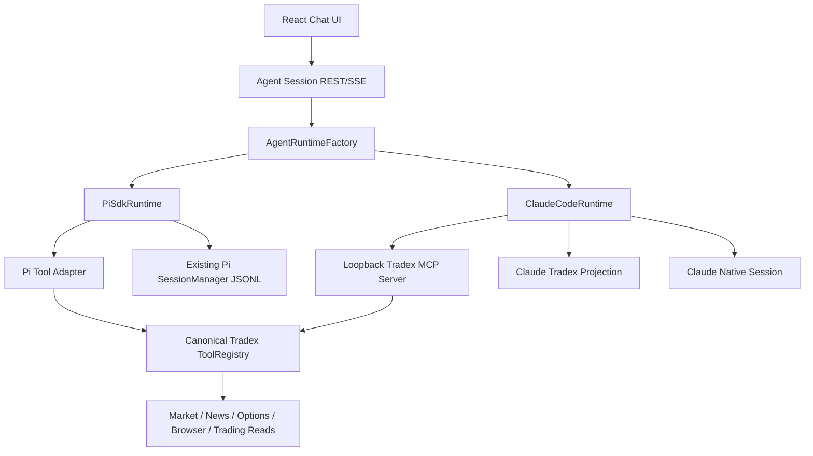

# Claude Code Runtime 接入方案

## 1. 目标

Tradex 在保留现有 Pi SDK Runtime 的前提下，增加本机 Claude Code Runtime。Claude Code 通过 headless `stream-json` 模式执行，继续使用 Tradex 当前的自绘聊天 UI、REST/SSE API 和 Agent/Session 产品模型，不引入 PTY/TUI。

首期交付目标：

- Agent 可选择 `pi` 或 `claude-code` Runtime。
- Pi SDK 的现有行为和历史 Session 保持兼容。
- Claude Code 复用用户本机安装、登录、订阅和默认模型配置。
- Claude 支持可选 model/effort 覆盖、流式文本、结构化工具事件、abort 和跨轮 resume。
- Tradex Tool 只定义一次；Pi 进程内调用，Claude 通过受控 MCP 调用。
- Claude 只获得 Tradex 自有的只读能力，不获得真实交易写权限。

本文是实施方案，不包含业务代码实现。

## 2. 已确认的范围

### 2.1 首期包含

- 普通交互 Agent Session。
- 本机 Claude Code探测和可用性展示。
- Claude headless进程管理。
- Claude `stream-json` 事件归一化。
- Runtime-neutral Session API和能力描述。
- Claude投影存储、原生 session ID捕获和 resume。
- Runtime-neutral Tool契约。
- Tradex内置 Streamable HTTP MCP Server。
- 每次 run的短期 MCP Session token。
- Claude只读 Tool allowlist。
- 图片附件的隔离目录读取。
- Claude原生 project state与 Tradex Session的联合删除。
- Agent设置和聊天 UI的 Runtime-aware行为。

### 2.2 首期不包含

- Cron使用 Claude Code。
- Memory读取、注入或写回 Claude Session。
- Claude真实下单、平仓、修改止盈止损。
- 用户配置的外部 MCP Server透传给 Claude。
- Claude运行中 steer。
- Claude任意消息节点 fork/clone。
- Claude Code安装、登录、token或自动升级管理。
- Codex Runtime。
- 将已有 Pi JSONL迁移到新格式。

## 3. 领域边界

本方案沿用并强化 [CONTEXT.md](../CONTEXT.md) 和 [ADR-0001](adr/0001-runtime-neutral-agents-and-session-snapshots.md) 的语言：

- **Agent** 是可复用 AI身份，绑定一个 Runtime及其默认配置。
- **Session** 是 Tradex持久化的产品会话，保存不可变 Agent snapshot。
- **Runtime** 是执行 Session的后端；`pi` 和 `claude-code` 是不同 Runtime。
- **Native Session** 是 Runtime内部用于恢复上下文的会话身份。
- **Tool** 是唯一的 Tradex业务能力定义。
- **Tool Transport** 是 Runtime调用 Tool的方式，不是第二套 Tool实现。

必须保持以下区分：

```text
Runtime = pi
Provider = anthropic
```

表示 Pi SDK使用 Anthropic API；而：

```text
Runtime = claude-code
```

表示使用用户本机 Claude Code身份和订阅。Claude Code不能伪装成 Pi Provider，也不进入 Pi ModelRegistry。

## 4. 总体架构



核心原则：

1. Runtime执行协议统一到 Tradex自己的事件和结果类型。
2. Tool业务定义保持一份，transport由 adapter决定。
3. 产品 Session ID与 Runtime native session ID分离。
4. 前端以 capability决定功能，不假设所有 Runtime能力完全相同。
5. Claude外部进程采用最小权限和显式 allowlist。

## 5. Runtime抽象

### 5.1 新增 Runtime-neutral类型

建议新增：

```text
tradex/agent/runtime/
├── types.ts
├── factory.ts
├── capabilities.ts
├── pi.ts
└── claude-code.ts
```

接口建议：

```ts
type RuntimeId = "pi" | "claude-code";

interface RuntimeCapabilities {
  streaming: boolean;
  abort: boolean;
  steer: boolean;
  resume: boolean;
  forkFromMessage: boolean;
  cloneFromMessage: boolean;
  imageInput: boolean;
  toolProgress: boolean;
}

interface AgentRunInput {
  tradexSessionId: string;
  nativeSessionId?: string;
  cwd: string;
  instructions: string;
  prompt: string;
  images?: RuntimeImage[];
  model?: string | null;
  effort?: string | null;
  tools: ToolRegistry;
}

interface ActiveAgentRun {
  readonly runtime: RuntimeId;
  readonly capabilities: RuntimeCapabilities;
  events(): AsyncIterable<RuntimeEvent>;
  result: Promise<RuntimeResult>;
  abort(): void | Promise<void>;
  steer?(message: RuntimeUserMessage): void | Promise<void>;
}

interface AgentRuntime {
  readonly id: RuntimeId;
  readonly capabilities: RuntimeCapabilities;
  start(input: AgentRunInput): Promise<ActiveAgentRun>;
}
```

### 5.2 Runtime能力矩阵

| 能力 | Pi SDK | Claude Code首期 |
| --- | --- | --- |
| 流式文本 | 支持 | 支持 |
| 结构化 Tool事件 | 支持 | MCP事件归一化后支持 |
| Abort | 支持 | 终止子进程树 |
| 运行中 steer | 支持 | 不支持 |
| 完成后继续对话 | 支持 | `--resume <nativeSessionId>` |
| 任意消息 fork/clone | 支持 | 不支持 |
| 图片输入 | Pi原生 image content | 写入隔离附件目录后由受控 MCP Tool读取 |
| Tool transport | 进程内 adapter | MCP over loopback HTTP |
| Memory | 保持现状 | 首期关闭 |
| Cron | 保持现状 | 首期关闭 |
| 交易写工具 | 保持现状 | 首期关闭 |

### 5.3 Pi Runtime改造原则

现有 [pi_runtime.ts](../tradex/agent/pi_runtime.ts) 不重写 Agent loop，只包装为 `PiSdkRuntime`：

- 保留 `createAgentSession()`。
- 保留 Pi `SessionManager`。
- 保留 `session.agent.toolExecution = "sequential"`。
- 保留 `steer()` 和 `abort()`。
- 将 Pi `AgentEvent`转换为 `RuntimeEvent`。
- 将 Runtime-neutral Tool通过 Pi Tool Adapter转换为 `defineTool()`。
- 不让 Pi通过 HTTP回调自身 MCP Server。

这样 Pi保持当前性能、取消传播、工具增量更新、`terminate` 和图片结果能力。

## 6. Claude Code进程协议

### 6.1 启动命令

新会话概念命令：

```bash
claude -p \
  --verbose \
  --output-format stream-json \
  --include-partial-messages \
  --permission-mode dontAsk \
  --strict-mcp-config \
  --mcp-config '<generated-config>' \
  --append-system-prompt '<instructions>' \
  --tools '<explicit Tradex MCP tools>' \
  --allowedTools '<explicit Tradex MCP tools>' \
  --session-id '<generated-native-uuid>' \
  '<prompt>'
```

恢复会话概念命令：

```bash
claude -p \
  --resume '<native-session-id>' \
  ...same controlled flags... \
  '<next prompt>'
```

若 Agent配置了覆盖项，则追加：

```bash
--model '<model>'
--effort '<effort>'
```

实现必须使用 `spawn(executable, argv, { shell: false })`，禁止拼接 shell字符串。

### 6.2 System prompt语义

领域字段统一理解为 Agent **Instructions**。首期磁盘兼容可以继续读取 `systemPrompt`，但 Runtime映射不同：

- Pi：继续通过 `systemPromptOverride`完整控制 Pi system prompt。
- Claude：通过 `--append-system-prompt`追加到 Claude Code默认 system prompt。

Claude instructions组成：

```text
MAIN_AGENT_PROMPT
+ Agent snapshot instructions
+ stable session date/runtime context
+ Claude首期能力和禁止项说明
```

Claude首期不加入 Memory context。

### 6.3 Model和effort

- Claude不进入 `ModelRuntimeSnapshot`、`AgentModelRegistry` 或 Provider设置页。
- `model = null` 时不传 `--model`，使用本机 CLI默认值。
- `effort = null` 时不传 `--effort`，使用本机 CLI默认值。
- 非空值直接作为 Claude Runtime配置验证并传入。
- Claude model/effort可维护一组当前产品已知值供 UI选择，但不能写入 Pi registry。
- 当前已验证的本机 Claude Code `2.1.196` effort值为 `low`、`medium`、`high`、`xhigh`、`max`。
- CLI最终仍是能力真相；无权限模型错误要归类为 Runtime执行错误。

### 6.4 事件归一化

新增 Claude stream-json parser，将完整 JSONL行转换成 `RuntimeEvent`：

```ts
type RuntimeEvent =
  | { type: "run-start"; nativeSessionId?: string }
  | { type: "message-start"; messageId: string }
  | { type: "text-delta"; messageId: string; delta: string }
  | { type: "tool-start"; callId: string; name: string; args: unknown }
  | { type: "tool-end"; callId: string; name: string; result: ToolContent[]; isError: boolean }
  | { type: "message-end"; message: RuntimeMessage; usage?: RuntimeUsage }
  | { type: "run-end"; result: RuntimeResult }
  | { type: "runtime-error"; error: RuntimeError };
```

Parser要求：

- 按完整行解析，保留跨 chunk缓冲。
- 未知事件记录 debug日志但不导致整个 run失败。
- 已知事件字段缺失时返回可分类协议错误。
- 首次出现 `session_id` 时立即持久化 native session pointer。
- stdout只接受协议数据；stderr单独收集并限长。
- 日志不得记录 prompt、MCP token或完整敏感 tool结果。
- 用固定 fixtures覆盖当前支持的 Claude版本事件形状。

### 6.5 Abort和进程回收

- `abort()` 终止 Claude子进程及其子进程树。
- SSE客户端断开继续沿用当前“停止无人观察运行”的行为。
- POSIX使用独立 process group并分阶段发送 TERM/KILL。
- Windows使用受控进程树终止实现，不依赖 shell命令拼接。
- 设置 `WaitDelay`或等价兜底，防止 pipe未关闭导致泄漏。
- abort后 projection记录 cancelled状态，不把部分回答当作正常完成。

### 6.6 Runtime错误分类

至少区分：

- executable missing
- unsupported version
- auth required/auth expired
- model unavailable/no entitlement
- malformed stream-json
- MCP connection/auth failure
- permission denied
- process exit failure
- timeout/inactivity
- aborted/client disconnected
- native session resume failure

API返回稳定的错误 code和用户可读 detail，stderr仅作为受限诊断证据。

## 7. Claude Runtime探测和配置

### 7.1 BYO local CLI边界

Tradex首期只负责：

- 从显式 `claudePath`或 `PATH`解析 `claude`。
- 调用 `claude --version`。
- 展示路径、版本和可用性。
- 启动本机进程。

Tradex不负责：

- 安装 Claude Code。
- Claude登录或 OAuth。
- 读取、复制或保存 Claude token/keychain。
- 将 Pi Anthropic API key注入 Claude。
- 自动升级 Claude Code。

### 7.2 可用性接口

新增类似：

```ts
type RuntimeAvailability =
  | { id: "claude-code"; status: "available"; path: string; version: string }
  | { id: "claude-code"; status: "missing" }
  | { id: "claude-code"; status: "auth-required"; detail: string }
  | { id: "claude-code"; status: "unsupported-version"; version: string }
  | { id: "claude-code"; status: "probe-failed"; detail: string };
```

建议增加：

- `GET /api/agent/runtimes`
- 后端启动时探测一次。
- 设置页支持手动 refresh。
- 运行前再次验证可执行路径仍存在。

## 8. Tool契约重构

### 8.1 去除 Pi类型泄漏

当前 [tools/registry.ts](../tradex/agent/tools/registry.ts) 引用了 Pi的：

- `AgentToolUpdateCallback`
- `ToolExecutionMode`
- `TextContent`
- `ImageContent`

新增 Runtime-neutral Tool类型，例如：

```text
tradex/agent/tools/types.ts
```

```ts
interface ToolExecutionContext {
  tradexSessionId: string;
  runtime: "pi" | "claude-code";
  signal?: AbortSignal;
  reportProgress?: (progress: TradexToolProgress) => void;
}

interface ToolPolicy {
  access: "read" | "write";
  domain: "market" | "news" | "social" | "browser" | "filesystem" | "trading" | "external";
  runtimeExposure: readonly RuntimeId[];
}

interface ToolDefinition {
  name: string;
  description: string;
  parameters: Record<string, unknown>;
  policy: ToolPolicy;
  execute(args: Record<string, unknown>, context: ToolExecutionContext): Promise<ToolReturnValue> | ToolReturnValue;
}
```

每个业务 Tool仍只维护一次。Pi Adapter和 MCP Export都遍历同一个 registry。

### 8.2 安全默认值

新 Tool默认不自动暴露给外部 Runtime。建议：

```text
未声明 policy.runtimeExposure
→ 只允许 pi
```

Claude-safe工具必须显式声明：

```ts
policy: {
  access: "read",
  domain: "market",
  runtimeExposure: ["pi", "claude-code"],
}
```

这样未来新增交易工具时不会因为忘记过滤而自动暴露给 Claude。

### 8.3 首期 Claude Tool集合

原则上允许：

- 行情和K线读取。
- 技术分析/价格行为计算。
- 新闻读取和显式刷新。
- 社交数据读取。
- 金十的 Tradex自有包装工具。
- 期权/GEX只读分析。
- 浏览器状态、打开和截图等经过审核的只读能力。
- 本地交易记录和交易所持仓/订单/成交查询。

禁止：

- `open_exchange_trade`
- `modify_tpsl`
- `close_position`
- 任何新增的账户、订单或交易写操作。
- Memory工具。
- 未经显式 allowlist的外部 MCP工具。
- 可绕过策略执行任意本机命令的 Tradex Tool。

具体 allowlist必须由测试固定，不能仅依赖名称前缀推断读写性质。

## 9. Tradex MCP Server

### 9.1 Transport

在现有 Hono后端挂载 loopback Streamable HTTP endpoint：

```text
POST/GET/DELETE http://127.0.0.1:8765/mcp/tradex
```

使用 `@modelcontextprotocol/sdk` 的 Server与 Streamable HTTP transport。它与当前 `McpClientManager` 是相反方向：

```text
现有：Tradex → 外部 MCP Server
新增：Claude → Tradex MCP Server
```

两者命名和模块必须明确区分，避免把 client management API与 server endpoint混在一起。

建议目录：

```text
tradex/mcp/server/
├── server.ts
├── transport.ts
├── tool-export.ts
├── auth.ts
└── session-token-store.ts
```

### 9.2 Run-scoped token

每次 Claude run创建不可预测的短期 token：

```ts
interface McpRunGrant {
  tokenHash: string;
  tradexSessionId: string;
  runtime: "claude-code";
  allowedTools: ReadonlySet<string>;
  expiresAt: number;
  abortSignal: AbortSignal;
}
```

约束：

- 原始 token只写入本次 Claude MCP配置，不写日志或 Session投影。
- 服务端只保存 hash。
- token绑定 Tradex Session和显式工具集合。
- run结束、abort或超时立即撤销。
- endpoint只接受 loopback连接，但 loopback不能替代 token认证。
- 每次 resume生成新 token，不复用旧 token。

### 9.3 工具导出

MCP `tools/list`只返回 grant允许且 Tool policy允许 Claude的交集。`tools/call`再次做相同授权，不能相信客户端刚刚看到的 list。

执行链：

```text
MCP request
→ authenticate grant
→ resolve canonical Tool
→ enforce ToolPolicy
→ build ToolExecutionContext
→ execute
→ map text/image content blocks to MCP result
```

必须保留：

- 图片 content block。
- `isError`语义。
- AbortSignal传播。
- Tool名称、描述和 input schema。

Pi专属的 `terminate`、`details`、progress若 MCP标准无法等价表达，不应伪造；Claude首期明确降级，并由 capability/test覆盖。

### 9.4 Claude MCP配置

每次 run在 Session目录生成临时配置，例如：

```text
~/.tradex/claude_sessions/<id>/runtime/mcp-<run-id>.json
```

配置只包含 Tradex Server，并配合：

```bash
--strict-mcp-config
```

run结束立即删除临时配置。文件权限限制为当前用户可读写。

## 10. Claude文件和权限边界

### 10.1 Session目录

每个 Claude Session拥有独立 cwd：

```text
~/.tradex/claude_sessions/<tradex-session-id>/
├── session.jsonl
├── metadata.json
├── attachments/
├── runtime/
└── logs/
```

- `session.jsonl` 是 Tradex UI投影，不是 Claude原生 transcript。
- `metadata.json` 保存 runtime、native session ID、Agent snapshot和状态。
- `attachments/` 保存用户本轮附件。
- `runtime/` 仅放短期配置。
- `logs/` 只放脱敏、限长的运行诊断。

路径必须通过 `homedir()`解析，不能在业务数据中接受任意绝对根目录。

### 10.2 Claude内置工具

首期：

- 附件只允许通过 `read_session_attachment` MCP Tool按当前 Session文件名读取。
- 允许显式 Tradex MCP Tool。
- 禁止 Bash/Edit/Write/NotebookEdit。
- 不默认启用 Claude WebFetch/WebSearch。
- 使用 `--permission-mode dontAsk`，无交互审批时未授权工具直接失败。

当前实现采用更严格的安全回退：不向 Claude开放原生 `Read`，由 `read_session_attachment` 校验文件名、Session目录、类型和大小后返回图片。仍需验证当前支持版本下：

- `--tools`/`--allowedTools` 对 MCP名称的匹配行为。
- Claude不能通过工具越过 Session附件目录读取敏感路径。

这一项是上线前安全门，不得仅靠单元测试推断。

## 11. Session持久化

### 11.1 双层身份

```text
Tradex Session ID
→ UI、REST、SSE、索引、Agent归属

Claude native session ID
→ claude --resume
```

两者不可互换。Claude native session ID在首次合法 stream-json事件中捕获并原子写入 metadata。

### 11.2 Repository抽象

新增 Runtime-neutral repository：

```ts
interface SessionRepository {
  create(snapshot: SessionAgentSnapshot): Promise<SessionRecord>;
  get(id: string): Promise<SessionPayload | null>;
  list(): Promise<SessionSummary[]>;
  appendEvent(id: string, event: PersistedSessionEvent): Promise<void>;
  updateNativeSessionId(id: string, nativeId: string): Promise<void>;
  delete(id: string): Promise<void>;
}
```

实现：

```text
PiSessionRepository
→ 包装现有 Pi SessionManager和现有目录

ClaudeSessionRepository
→ ~/.tradex/claude_sessions/<id>/
```

现有 Pi JSONL不迁移。列表和单 Session API通过组合 repository返回统一 DTO。

### 11.3 Claude投影内容

投影至少保存：

- Session header和 Agent snapshot。
- user message。
- assistant最终 message。
- Tool call declaration。
- Tool result展示内容。
- usage和错误。
- native session ID变化。
- run start/end/cancel状态。

文本 delta只走 SSE，不逐 token落盘；沿用当前 Pi的“开始时 placeholder、结束时回填”理念，避免高频重写。

Claude原生 transcript负责下轮模型上下文；Tradex projection负责：

- UI历史。
- Session列表和搜索。
- Runtime-neutral API。
- 将来 Memory接入的数据来源。

projection不得被重新拼接成 Claude resume上下文；native resume失败时应显式失败，不能静默退化为历史重放。

### 11.4 Session索引

当前历史列表建立在 Pi Session扫描/索引假设上。需要统一索引字段：

- `id`
- `runtime`
- `agent_id`
- `title`
- `provider`（Pi可用，Claude为空或 runtime-specific display）
- `model`
- `native_session_id`（敏感度评估后可只存在 metadata）
- `created_at`
- `updated_at`
- `message_count`
- `first_message`

若继续使用 SQLite，应把它明确为跨 Runtime投影索引；JSONL/metadata仍是权威数据源。

## 12. Resume、Steer、Fork和Clone

### 12.1 Resume

Claude第二轮使用保存的 native session ID：

```bash
claude -p --resume <native-session-id> ... <next-prompt>
```

每一轮仍生成新的 MCP token和临时配置。Resume前必须验证：

- Tradex Session runtime是 `claude-code`。
- native session ID存在。
- Session目录存在。
- Claude Runtime可用。

### 12.2 Steer

Claude首期 `capabilities.steer = false`。前端运行中不得把追加输入发送到 `/steer`；应隐藏或禁用，并显示该 Runtime不支持运行中追加指令。

### 12.3 Fork/clone

Claude首期：

- `forkFromMessage = false`
- `cloneFromMessage = false`

现有 endpoints对 Claude Session返回稳定的 capability错误，例如 `runtime_capability_unsupported`，前端应提前隐藏入口。

禁止用 Tradex projection重放来模拟 fork，因为这会丢失 Claude原生 tool上下文、压缩状态和内部 metadata。

## 13. Session删除

Claude Session与独立 cwd一一对应，因此使用 Claude官方 project删除入口：

```bash
claude project purge \
  ~/.tradex/claude_sessions/<tradex-session-id> \
  --yes
```

删除事务顺序：

1. 获取 Session删除锁，确认无 active run。
2. 校验 Runtime为 `claude-code`。
3. 从可信 Session ID计算目录，禁止用户传入任意路径。
4. 执行 `claude project purge <dir> --yes`。
5. project不存在视为幂等成功；其他失败终止删除。
6. 删除 Tradex projection、metadata、附件、日志和索引。
7. 返回更新后的历史列表。

如果 Claude CLI缺失或 purge失败，Tradex数据暂不删除并返回可重试错误。不得出现“UI已删除但 Claude原生状态仍存在”的部分成功。

需要为 purge命令增加版本探测；若最低支持版本没有该命令，应将该版本标为不支持 Claude Runtime，而不是回退到直接删除 `~/.claude/projects`内部文件。

## 14. Agent模型改动

### 14.1 后端类型

当前 [agent_store.ts](../tradex/agent/agent_store.ts) 把 Runtime限制为 `"pi"`。建议改为 discriminated union：

```ts
type AgentRuntimeConfig =
  | {
      runtime: "pi";
      provider: string | null;
      model: string | null;
      reasoningEffort: string | null;
    }
  | {
      runtime: "claude-code";
      provider: null;
      model: string | null;
      reasoningEffort: string | null;
    };
```

兼容规则：

- 现有文件的 `runtime: "pi"`原样有效。
- 缺失 runtime的遗留文件若存在，应显式迁移/兼容为 Pi。
- Claude Agent的 `provider`必须为 `null`。
- Claude model/effort只用于 CLI flags，不进入 Pi registry验证。
- Default Agent继续保持 Pi，避免升级后改变已有默认行为。

### 14.2 Session snapshot

将当前固定：

```ts
runtime: "pi"
```

扩为：

```ts
runtime: "pi" | "claude-code"
```

Session创建后 snapshot不可因 Agent后续编辑而改变。运行时必须从 Session snapshot解析，不能从当前 Agent文件重新读取 Runtime。

### 14.3 删除 Agent检查

当前删除 Agent只扫描 Pi SessionManager。需要改为跨 Runtime Session repository查询，确保只要 Pi或 Claude Session引用该 Agent，就不能删除。

## 15. API和路由改动

### 15.1 Agent CRUD

- `POST /api/agents` 接受 Runtime union并做 Runtime-specific验证。
- `PUT /api/agents/:id` 同上。
- `GET /api/agents` 返回 runtime capabilities/availability的引用信息或由单独接口提供。

### 15.2 Session CRUD

- `POST /api/agent/sessions` 根据 Agent snapshot选择 repository。
- `GET /api/agent/sessions` 聚合 Pi和 Claude摘要。
- `GET /api/agent/sessions/:id` 路由到对应 repository。
- `DELETE /api/agent/sessions/:id` 对 Claude先执行 project purge。
- fork/clone endpoints做 capability gate。

### 15.3 Message stream

当前 [agent.ts](../tradex/api/routes/agent.ts) 集中了 Tool组装、Pi Runtime创建、Pi事件转换、持久化和 SSE。应拆成：

```text
Route orchestration
├── resolve Session + snapshot
├── build Runtime-allowed ToolRegistry
├── create Runtime run
├── persist normalized events
└── map RuntimeEvent → existing SSE DTO
```

不建议在现有 switch中继续堆 Claude专属分支；先提取公共 orchestrator，再接两个 Runtime adapter。

### 15.4 Active runs

`AppRuntime.activeAgents` 类型从 Pi-specific `ActiveAgentRun`改为 Runtime-neutral handle。锁仍以 Tradex Session ID为 key。

### 15.5 MCP endpoint

新增 MCP路由不能与现有 `/api/mcp/*` 管理 API混淆。前者是 Agent调用协议端点，后者是用户管理 Tradex作为 MCP Client的配置 UI。

## 16. SSE和前端兼容

尽量保持现有 SSE外部事件：

- `agent_start`
- `message_start`
- `message_update`
- `tool_execution_start`
- `tool_execution_end`
- `message_end`
- `agent_end`
- `session_update`

Claude parser先生成 RuntimeEvent，route adapter再生成现有 SSE DTO。这样前端消息渲染无需为 Claude复制一套实现。

新增到 Session DTO：

```ts
runtime: "pi" | "claude-code";
capabilities: RuntimeCapabilities;
```

前端必须根据 capability控制：

- steer输入。
- fork按钮。
- clone按钮。
- model/provider控件。
- Runtime不可用提示。

Claude MCP Tool事件要保留业务 Tool名称，不能全部显示成通用 `Bash`。

## 17. 前端改动点

### 17.1 类型和 API

- `web/src/types.ts`：Agent Runtime union、Session runtime、capabilities、Runtime availability。
- `web/src/api.ts`：Runtime探测接口和新的错误 code。
- `web/src/stores/agentStore.ts`：不再假定所有 Session都属于 Pi Provider/ModelRegistry。

### 17.2 Agents设置

[AgentsSettingsPanel.tsx](../web/src/components/settings/AgentsSettingsPanel.tsx) 增加 Runtime选择：

- Pi：保留 Provider/Model/effort控件。
- Claude Code：隐藏 Provider；显示可选 Claude model和effort。
- 展示本机 Claude Code availability、path、version。
- Runtime不可用时允许保存 Agent，但清楚提示无法运行；或禁止保存需要产品最终确认。首期建议允许保存、运行时阻止，便于先配置后安装。

### 17.3 Chat面板

- Claude运行中隐藏 steer或显示只读状态。
- Claude Session隐藏 fork/clone。
- Abort保持可用。
- Runtime错误显示明确修复建议。
- Provider icon不能再承担 Runtime icon职责；增加独立 Runtime badge。
- Claude model为空时显示 `Claude Code default`，不要显示 Pi全局模型。

### 17.4 图片

- 上传仍使用现有前端请求格式。
- 后端将 Claude附件写入 `attachments/`。
- 文件名由后端生成，保留经过验证的 MIME扩展。
- 限制单文件大小、总大小、数量和支持格式。
- Prompt只加入相对路径，不加入用户提供的原始文件名路径。

## 18. Memory兼容边界

首期 Claude完全跳过：

- `memoryPort.buildTools()`。
- `memoryPort.getPromptContext()`。
- `memoryPort.recordAssistantResponse()`。

现有 Memory pipeline若扫描 Agent Session，必须能够忽略或安全读取 Claude projection，不能把 Claude metadata当 Pi message解析。

后续 Memory接入时，以 Runtime-neutral projection为来源，而不是读取 Claude原生 transcript。

## 19. Cron兼容边界

当前 [cron/runner.ts](../tradex/cron/runner.ts) 直接依赖：

- `createPiSession()`。
- `createPiAgentRuntime()`。
- Pi `AssistantMessage`。
- Pi model selection。
- Pi turn计数。

首期保持 Pi-only，不在 Claude接入时顺便修改执行语义。但 Runtime抽象必须能被未来 Cron复用，禁止只针对 HTTP Route设计。

Cron重构 TODO应单独包含：

- Cron Runtime选择和 Agent snapshot。
- 无人值守权限策略。
- Runtime-neutral max iterations/turn语义。
- 独立 projection和结果摘要。
- Claude headless超时、重试和删除策略。
- 交易写权限继续默认关闭。

## 20. 配置和路径

建议新增应用配置：

```ts
interface ClaudeCodeRuntimeConfig {
  executablePath?: string | null;
  minimumVersion?: string | null;
  sessionRoot: string; // default ~/.tradex/claude_sessions
  runTimeoutMs: number;
  inactivityTimeoutMs: number;
  mcpTokenTtlMs: number;
}
```

安全关键配置不允许 Agent文件覆盖：

- session root。
- MCP endpoint。
- MCP token。
- allowed tools。
- permission mode。
- executable环境清理策略。

## 21. 实施步骤

### Phase 0：协议 fixtures和安全探针

1. 固定最低 Claude Code版本。
2. 采集脱敏 stream-json fixtures：文本、MCP Tool、图片读取、错误、abort、resume。
3. 验证 `--tools`、`--strict-mcp-config`、`dontAsk`和 Read目录行为。
4. 验证 `claude project purge <cwd> --yes`。

退出条件：无法证明 Tool和文件权限边界时不进入生产实现。

### Phase 1：Runtime-neutral基础

1. 新增 Runtime类型、event、result、capabilities。
2. 将现有 Pi Runtime包装为 adapter。
3. 抽取 route orchestrator和 SSE映射。
4. 保持全部现有 Pi测试通过。

### Phase 2：Tool契约与MCP Server

1. 移除 ToolRegistry中的 Pi类型泄漏。
2. 新增 Pi Tool Adapter。
3. 给 Tool增加安全 policy并完成 Claude allowlist。
4. 实现 MCP Server、token store和 tool export。
5. 为认证、授权、图片、取消、错误增加测试。

### Phase 3：Claude进程Runtime

1. 实现探测和版本检查。
2. 实现安全 argv builder。
3. 实现 stream-json parser。
4. 实现进程生命周期、abort、timeout和stderr限制。
5. 实现 native session ID捕获和 resume。

### Phase 4：Session repository

1. 定义统一 repository/DTO。
2. 包装现有 Pi repository，不迁移旧文件。
3. 实现 Claude projection和索引。
4. 实现附件目录和原子写入。
5. 实现 `claude project purge`删除事务。

### Phase 5：API和前端

1. 扩展 Agent Runtime union。
2. 增加 runtime availability API。
3. Agents设置页 Runtime-aware控件。
4. Session capability控制 steer/fork/clone。
5. 错误、图标和默认模型文案。

### Phase 6：端到端验证

1. 新 Claude Session文本对话。
2. MCP行情 Tool调用和前端 Tool卡片。
3. 图片附件读取。
4. Abort和客户端断开。
5. 第二轮 resume。
6. 删除同时清理 Claude project和 Tradex数据。
7. Pi回归全量验证。

## 22. 测试计划

### 22.1 单元测试

- Agent Runtime union验证。
- Claude argv builder和转义。
- stream-json chunk/line parser。
- 未知事件向前兼容。
- usage和错误映射。
- capability gate。
- Session路径穿越防护。
- MCP token生成、hash、过期、撤销。
- tools/list和tools/call双重授权。
- Tool policy默认拒绝。
- Claude projection原子写入和恢复。
- purge成功、not-found、失败、CLI缺失。

### 22.2 集成测试

- 使用 fake Claude executable输出 fixtures，验证完整 SSE。
- fake Claude捕获 argv，验证无 shell插值。
- 本机 MCP Client调用 Tradex MCP Server。
- token不能跨 Session调用。
- abort传播到长运行 Tool。
- Pi和 Claude Session聚合列表。
- 删除 Agent时同时检查两类 Session。

### 22.3 真实 CLI验收

- 已登录 Claude Code新建 Session。
- model/effort默认和覆盖。
- Tradex只读 MCP Tool调用。
- 禁止 Bash/Edit/Write。
- 读取 Session附件，但不能越权读取敏感路径。
- resume保持上下文。
- abort后无残留进程。
- purge后 `claude --resume <id>`不能恢复且 Tradex目录被删除。

### 22.4 回归命令

实现完成后至少运行：

```bash
npm run typecheck
npm run test:backend
npm test
npm run build:backend
npm run build
```

## 23. 可观测性

结构化日志字段：

- `runtime`
- `tradex_session_id`
- `run_id`
- `native_session_id`（必要时截断/哈希）
- `claude_version`
- `event_type`
- `tool_name`
- `duration_ms`
- `exit_code`
- `failure_reason`

禁止记录：

- MCP bearer token。
- Claude登录材料。
- 完整 system instructions。
- 用户图片base64。
- 可能含凭据的完整 stderr/env。

## 24. 主要风险与缓解

| 风险 | 缓解 |
| --- | --- |
| Claude stream-json版本漂移 | 最低版本、fixtures、未知事件容忍、协议错误分类 |
| Headless权限等待 | `dontAsk` + 显式 tools + 真机验收 |
| Read越权 | 独立 cwd、安全探针；不可靠则改为 MCP附件 Tool |
| MCP token泄漏 | 短期、hash存储、日志遮蔽、run结束撤销 |
| Tool误暴露 | 默认 Pi-only，Claude显式 allowlist |
| 交易误操作 | Claude首期不注册写工具 |
| Pi行为回归 | Pi adapter只做边界包装，旧 JSONL不迁移 |
| Projection与native历史不一致 | native负责模型恢复，projection负责UI；不静默重放 |
| 删除部分成功 | 先 Claude purge，后 Tradex清理；失败可重试 |
| 孤儿进程 | process group/tree回收、timeout和断连abort |

## 25. TODO / 后续工作

以下项目明确不属于首期，但必须保留跟踪：

1. **Cron Runtime-neutral重构**：解除 `cron/runner.ts` 对 Pi Session和事件类型的直接依赖，再评估 Claude Cron。
2. **Memory接入 Claude**：从 Runtime-neutral projection读取、注入和写回；不解析 Claude内部 transcript。
3. **Claude交易审批协议**：在开放任何写工具前设计用户确认、幂等、审计和超时语义。
4. **外部 MCP显式透传**：增加 per-server/per-tool `exposeToRuntimes` allowlist、重名和超时策略。
5. **Claude steer**：只有确实需要时才升级为双向 stream-json stdin管理。
6. **Claude fork/clone**：定义 native fork能力和产品语义，禁止用 projection伪造。
7. **Codex Runtime**：复用 Runtime、Session、Tool和 MCP边界，首选 headless JSON路径。
8. **Claude原生模型目录发现**：若手工 model/effort配置体验不足，再增加独立 discovery，不污染 Pi registry。
9. **CLI shim**：作为人类终端/脚本入口评估；仍复用同一个 canonical ToolRegistry。

## 26. 完成定义

首期只有在以下条件同时满足时才算完成：

- 现有 Pi Agent、Session、Tool、steer、fork/clone没有行为回归。
- Claude可从 UI创建 Agent和 Session并完成多轮 resume。
- Claude的 Tool调用在 UI中保持业务 Tool名称和结构化参数。
- Claude无法调用交易写工具、Bash、Edit或Write。
- MCP token无法跨 Session、过期或在 run结束后使用。
- Claude Session删除同时完成官方 project purge和 Tradex清理。
- Cron与Memory仍明确保持 Pi-only，没有隐式半支持。
- 类型检查、后端测试、前端测试和构建通过。
